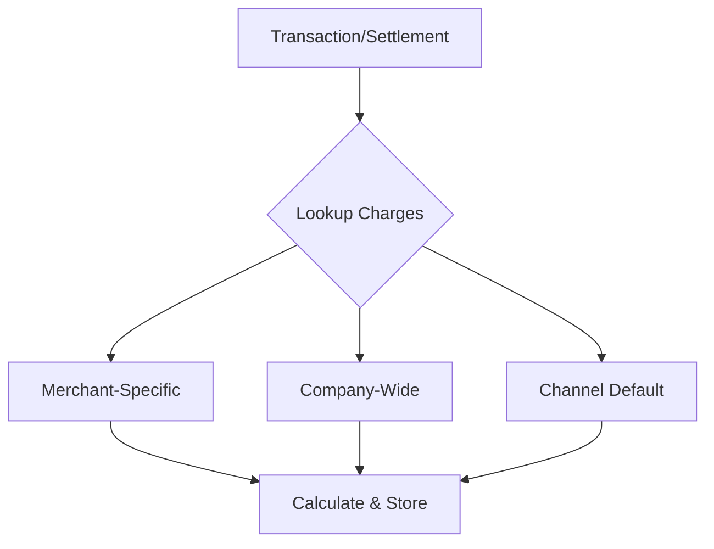

# Charging System Architecture

## Overview

The charging system is designed to handle transaction and settlement charges with a hierarchical configuration approach. It supports both fixed and percentage-based charges, with the ability to define charges at different levels (channel, company, merchant) and automatically applies the most specific applicable charge.



## Database Schema

### Charges Table
Stores charge configurations at different levels:

```sql
CREATE TABLE charges (
    id bigint PRIMARY KEY,
    channel varchar(20),          -- MOBILE_MONEY, CARD, etc
    charge_name varchar(50),      -- PROVIDER_MDR, PLATFORM_FEE, etc
    description varchar(255),
    charge_type varchar(20),      -- FIXED or PERCENTAGE
    charge_value decimal(10,2),   -- Amount or percentage
    max_amount decimal(10,2),     -- Cap for percentage charges
    min_amount decimal(10,2),     -- Minimum charge amount
    is_default boolean,           -- True for channel-level defaults
    company_id bigint NULL,       -- For company-wide charges
    merchant_id varchar NULL,     -- For merchant-specific charges
    created_by bigint,
    updated_by bigint,
    is_active boolean,
    timestamps
);
```

### Transaction Charges Table
Records calculated charges for transactions and settlements:

```sql
CREATE TABLE transaction_charges (
    id bigint PRIMARY KEY,
    transaction_id bigint NULL,
    settlement_id bigint NULL,
    charge_id bigint,
    charge_name varchar(50),
    charge_type varchar(20),
    charge_value decimal(10,2),
    base_amount decimal(20,2),
    calculated_amount decimal(20,2),
    merchant_id varchar,
    timestamps
);
```

## Component Architecture

### 1. Models

#### Charges Model
- Handles charge configuration and calculations
- Provides methods for charge lookup and calculation
```php
class Charges extends Model {
    // Calculate charge amount with min/max constraints
    public function calculateCharge($amount): float

    // Get applicable charges in priority order
    public static function getApplicableCharges($channel, $merchantCode, $companyId)
}
```

#### TransactionCharges Model
- Records calculated charges
- Links to transactions/settlements and original charge rules
```php
class TransactionCharges extends Model {
    // Relationships to transactions, settlements, charges
    public function transaction(): BelongsTo
    public function settlement(): BelongsTo
    public function charge(): BelongsTo
}
```

### 2. Command

ProcessCharges command runs every 5 minutes to process pending charges:

```php
class ProcessCharges extends Command {
    // Process completed transactions
    private function processTransactions()

    // Process settled records
    private function processSettlements()
}
```

## Charge Processing Flow

1. **Charge Lookup**
   ```mermaid
   flowchart TD
       A[Start] --> B{Merchant-specific<br>charge exists?}
       B -->|Yes| C[Use merchant charge]
       B -->|No| D{Company-wide<br>charge exists?}
       D -->|Yes| E[Use company charge]
       D -->|No| F[Use channel default]
       C --> G[Calculate charge]
       E --> G
       F --> G
       G --> H[Store result]
   ```

2. **Charge Calculation**
   ```mermaid
   flowchart TD
       A[Get charge rule] --> B{Charge type?}
       B -->|Fixed| C[Use fixed amount]
       B -->|Percentage| D[Calculate percentage]
       C --> E{Has min amount?}
       D --> E
       E -->|Yes| F[Apply min]
       E -->|No| G{Has max amount?}
       F --> G
       G -->|Yes| H[Apply max]
       G -->|No| I[Return amount]
       H --> I
   ```

## Usage Examples

### 1. Creating Charges

```php
// Channel default
Charges::create([
    'channel' => 'MOBILE_MONEY',
    'charge_name' => 'PROVIDER_MDR',
    'charge_type' => 'PERCENTAGE',
    'charge_value' => 2.00,
    'is_default' => true
]);

// Company-specific
Charges::create([
    'channel' => 'MOBILE_MONEY',
    'charge_name' => 'PROVIDER_MDR',
    'charge_type' => 'PERCENTAGE',
    'charge_value' => 1.80,
    'company_id' => $companyId
]);

// Merchant-specific
Charges::create([
    'channel' => 'MOBILE_MONEY',
    'charge_name' => 'TRANSACTION_FEE',
    'charge_type' => 'FIXED',
    'charge_value' => 0.30,
    'merchant_id' => $merchantCode
]);
```

### 2. Processing Charges

```bash
# Process all pending charges
php artisan charges:process

# Process only transactions
php artisan charges:process transactions

# Process only settlements
php artisan charges:process settlements
```

## Scheduling

The charge processing command runs automatically:

```php
// routes/console.php
Schedule::command('charges:process')
    ->everyFiveMinutes()
    ->runInBackground()
    ->withoutOverlapping();
```

## Error Handling

1. Failed charges are marked with `charges_status = 'FAILED'`
2. Errors are logged with transaction/settlement ID
3. Each record is processed in a database transaction
4. Processing continues even if individual records fail

## Monitoring

Monitor charge processing through:
1. Transaction/settlement charges_status
2. System logs for failures
3. TransactionCharges records for successful calculations
