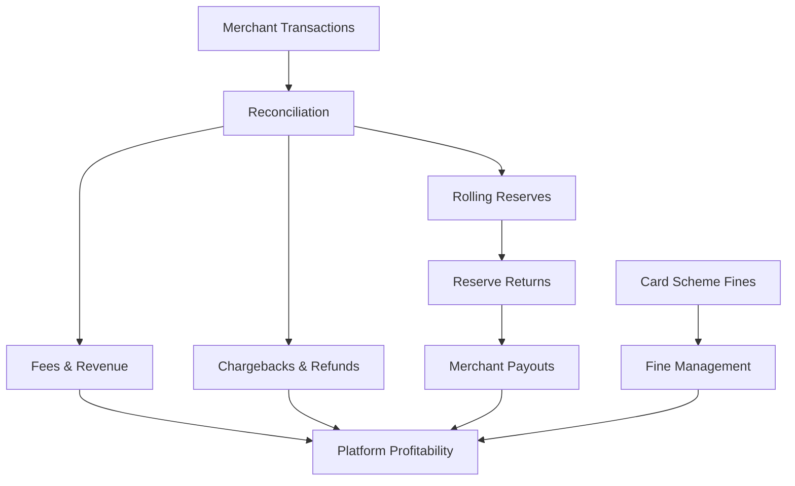
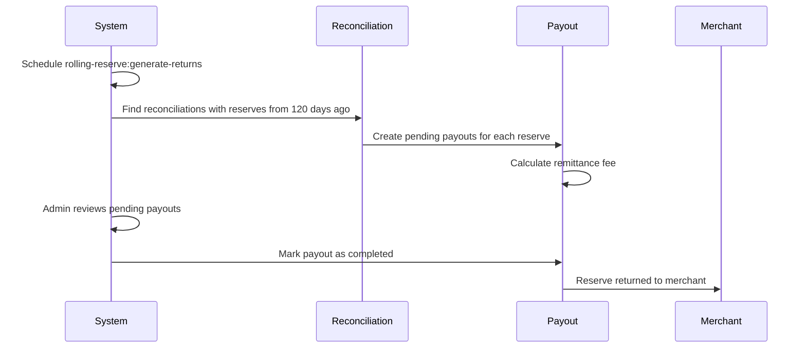
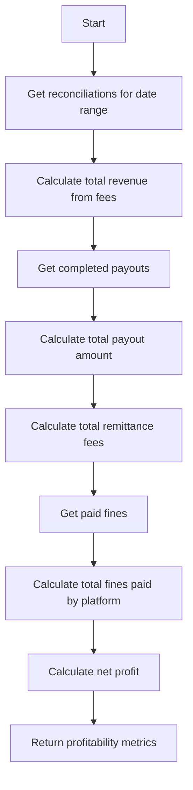

# Merchant Financial Tracking System

## Overview

The Merchant Financial Tracking System is designed to provide comprehensive tracking of the financial relationship between the platform and merchants. It tracks various financial aspects including rolling reserves, payouts, remittance fees, and fines from card schemes/regulators.



## Database Schema

### Merchant Payouts Table
Tracks all types of payouts to merchants:

```sql
CREATE TABLE merchant_payouts (
    id bigint PRIMARY KEY,
    merchant_id varchar(255),
    amount decimal(15,2),
    type varchar(255),           -- SETTLEMENT, ROLLING_RESERVE_RETURN, REFUND, etc.
    status varchar(255),         -- PENDING, COMPLETED, FAILED, CANCELLED
    reference varchar(255),      -- Payment reference/transaction ID
    remittance_fee decimal(15,2),-- Fees for sending the payment
    initiated_at timestamp,
    completed_at timestamp,
    initiated_by varchar(255),   -- User who initiated the payout
    notes text,
    timestamps
);
```

### Merchant Fines Table
Tracks fines from card schemes and regulators:

```sql
CREATE TABLE merchant_fines (
    id bigint PRIMARY KEY,
    merchant_id varchar(255),
    amount decimal(15,2),
    issuer varchar(255),         -- VISA, MASTERCARD, REGULATOR, etc.
    reason varchar(255),
    status varchar(255),         -- PENDING, PAID, DISPUTED, WAIVED
    reference varchar(255),
    issued_date date,
    due_date date,
    paid_date date,
    paid_by varchar(255),        -- MERCHANT or PLATFORM
    notes text,
    timestamps
);
```

## Component Architecture

### 1. Models

#### MerchantPayout Model
- Tracks all types of payouts to merchants
- Manages payout status lifecycle
- Calculates net amount after remittance fees

```php
class MerchantPayout extends Model {
    // Mark payout as completed
    public function markAsCompleted($reference = null): bool
    
    // Mark payout as failed
    public function markAsFailed($notes = null): bool
    
    // Mark payout as cancelled
    public function markAsCancelled($notes = null): bool
    
    // Get net amount (after remittance fee)
    public function getNetAmountAttribute(): float
}
```

#### MerchantFine Model
- Tracks fines from card schemes and regulators
- Manages fine status lifecycle
- Provides filtering for overdue fines

```php
class MerchantFine extends Model {
    // Mark fine as paid
    public function markAsPaid($paidBy = null, $paidDate = null): bool
    
    // Mark fine as disputed
    public function markAsDisputed($notes = null): bool
    
    // Mark fine as waived
    public function markAsWaived($notes = null): bool
    
    // Scope for overdue fines
    public function scopeOverdue($query): Builder
}
```

#### MerchantReconciliation Model
- Extended to support rolling reserve tracking
- Creates and tracks rolling reserve return payouts

```php
class MerchantReconciliation extends Model {
    // Create a rolling reserve return payout
    public function createRollingReserveReturnPayout($initiatedBy = null): ?MerchantPayout
    
    // Get existing rolling reserve return payout
    public function getRollingReserveReturnPayout(): ?MerchantPayout
}
```

#### Merchants Model
- Extended to calculate merchant profitability
- Considers revenue, payouts, remittance fees, and fines

```php
class Merchants extends Model {
    // Calculate profitability for a date range
    public function calculateProfitability($startDate = null, $endDate = null): array
}
```

### 2. Commands

#### GenerateRollingReserveReturns Command
Automatically generates pending payouts for rolling reserves due to be returned:

```php
class GenerateRollingReserveReturns extends Command {
    // Command signature with options
    protected $signature = 'rolling-reserve:generate-returns 
                          {--days=120 : Days to hold reserve}
                          {--merchant= : Specific merchant ID}
                          {--date= : Specific date to process}';
                          
    // Main command handler
    public function handle(): void
}
```

## Processing Flows

### 1. Rolling Reserve Return Flow



### 2. Merchant Profitability Calculation



## Admin Interface

The system includes a comprehensive admin interface built with Filament v3:

### 1. Merchant Payout Management
- List, create, edit, and delete payouts
- Filter by type, status, and date
- Mark payouts as completed or failed
- View payout details and history

### 2. Merchant Fine Management
- List, create, edit, and delete fines
- Filter by issuer, status, and date
- Mark fines as paid, disputed, or waived
- View fine details and history

### 3. Rolling Reserve Returns
- View rolling reserves due to be returned
- Filter by merchant, date, and status
- Create payouts for rolling reserve returns
- Track status of rolling reserve return payouts

### 4. Dashboard Widgets
- Merchant Profitability Chart: Shows revenue, payouts, and net profit for top merchants
- Merchant Finance Stats: Shows pending payouts, recent payouts, pending rolling reserves, and pending fines

## Usage Examples

### 1. Generating Rolling Reserve Returns

```bash
# Generate returns for all merchants using default 120-day period
php artisan rolling-reserve:generate-returns

# Generate returns for a specific merchant
php artisan rolling-reserve:generate-returns --merchant=MERCHANT_CODE

# Generate returns for a specific date
php artisan rolling-reserve:generate-returns --date=2024-01-01

# Use a custom holding period
php artisan rolling-reserve:generate-returns --days=90
```

### 2. Calculating Merchant Profitability

```php
// Get merchant
$merchant = Merchants::where('code', 'MERCHANT_CODE')->first();

// Calculate profitability for default period (last year to now)
$profitability = $merchant->calculateProfitability();

// Calculate profitability for specific date range
$startDate = Carbon::parse('2024-01-01');
$endDate = Carbon::parse('2024-12-31');
$profitability = $merchant->calculateProfitability($startDate, $endDate);

// Access profitability metrics
$totalRevenue = $profitability['total_revenue'];
$totalPayouts = $profitability['total_payouts'];
$totalRemittanceFees = $profitability['total_remittance_fees'];
$totalFinesPaid = $profitability['total_fines_paid'];
$netProfit = $profitability['net_profit'];
$isProfitable = $profitability['is_profitable'];
```

## Integration with Existing Systems

The Merchant Financial Tracking System integrates with the following existing systems:

### 1. Reconciliation System
- Uses settlement records to calculate rolling reserves
- Tracks when rolling reserves are due to be returned
- Creates payouts for returned reserves

### 2. Charging System
- Uses transaction charges to calculate revenue
- Considers platform fees, application fees, and bank fees
- Tracks rolling reserve charges

### 3. Reporting System
- Provides data for merchant profitability reports
- Tracks payout and fine status for reporting
- Generates financial summaries

## Security Considerations

1. **Access Control**
   - Role-based access to financial data
   - Audit logging for all financial actions
   - Approval workflows for payouts

2. **Data Protection**
   - Encryption for sensitive financial data
   - Secure storage of payment references
   - Compliance with financial regulations

## Monitoring and Alerts

1. **System Monitoring**
   - Track pending payouts and fines
   - Monitor rolling reserve return process
   - Alert on overdue fines

2. **Financial Monitoring**
   - Track merchant profitability trends
   - Monitor remittance fee costs
   - Alert on significant financial changes

## Future Enhancements

1. **Advanced Reporting**
   - Detailed profitability analysis
   - Trend analysis for merchant performance
   - Forecasting for future reserves and payouts

2. **Integration Expansion**
   - Connect with accounting systems
   - Integrate with payment processors for automated payouts
   - Link with regulatory compliance systems

3. **Automation Improvements**
   - Automated approval workflows
   - Scheduled payout processing
   - Intelligent fine dispute handling
