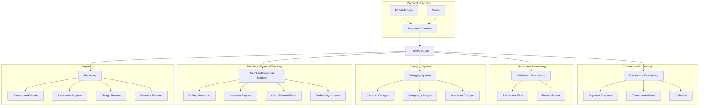
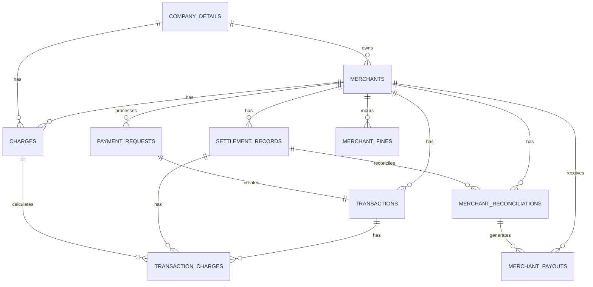
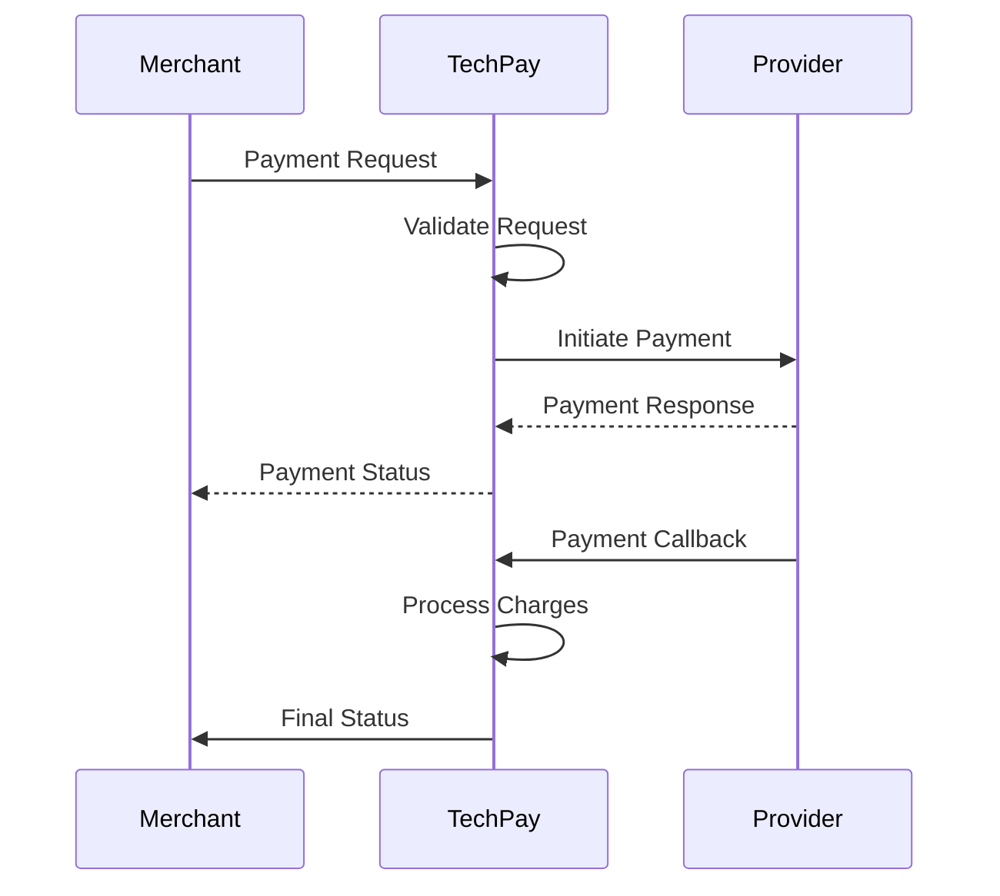
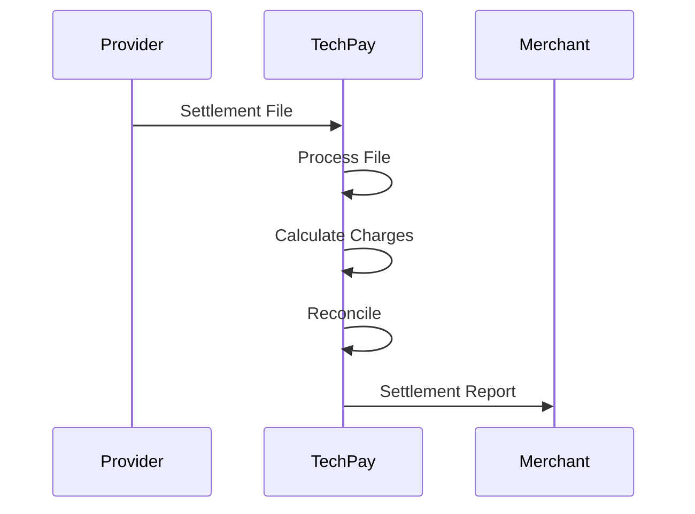
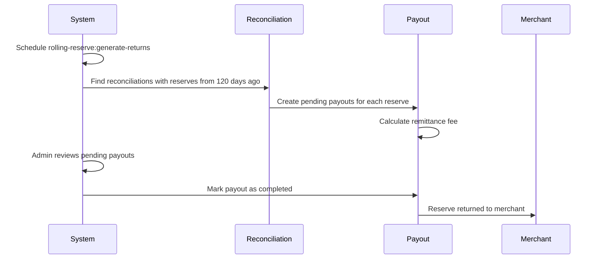
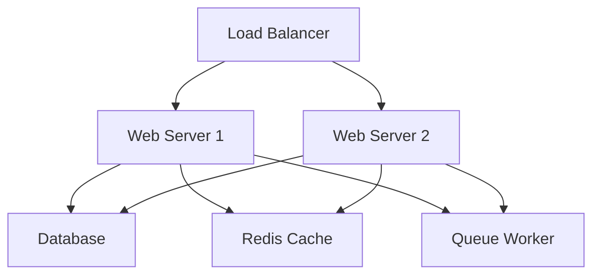

# TechPay Core System Architecture

## System Overview

TechPay Core is a payment processing system that handles various payment channels, merchant integrations, and transaction processing. The system is built with Laravel and follows a modular architecture.

## Core Components

### 1. Payment Processing
- Handles payment requests through various channels (Mobile Money, Cards)
- Manages transaction lifecycle and status updates
- Processes callbacks and notifications
- See: `app/Http/Controllers/Frontend/CheckOutController.php`

### 2. Settlement Processing
- Processes settlement files from different providers
- Handles reconciliation
- Manages settlement status and records
- See: `app/Models/SettlementRecord.php`

### 3. Charging System
- Configures and calculates transaction charges
- Supports hierarchical charge rules
- Processes charges for transactions and settlements
- See: [Charging System Architecture](charging-system-architecture.md)

### 4. Merchant Financial Tracking
- Tracks the financial relationship with merchants
- Manages rolling reserves and their return to merchants
- Handles payouts, remittance fees, and card scheme fines
- Calculates merchant profitability metrics
- See: [Merchant Financial Tracking](merchant-financial-tracking.md)

### 5. Reporting
- Generates transaction and settlement reports
- Provides charge breakdowns and summaries
- Handles report scheduling and distribution

## Database Architecture

## Integration Points

### 1. Payment Providers
- MPGS (Mastercard Payment Gateway)
- Cybersource
- Airtel Money
- MTN Mobile Money
- See: `app/Integrations/`

### 2. External Systems
- Settlement file processors
- Reporting systems
- Notification services

## Processing Flows

### 1. Payment Flow

### 2. Settlement Flow

### 3. Rolling Reserve Return Flow

## Security Architecture

1. **Authentication**
   - API authentication using tokens
   - User authentication via Laravel sanctum
   - Role-based access control

2. **Data Protection**
   - Encryption at rest for sensitive data
   - Secure communication channels
   - PCI compliance measures

## Monitoring and Logging

1. **System Monitoring**
   - Transaction monitoring
   - Performance monitoring
   - Error tracking and alerts

2. **Logging**
   - Transaction logs
   - API request logs
   - Error logs
   - Audit trails

## Development Guidelines

1. **Code Organization**
   - Follow Laravel conventions
   - Use service classes for business logic
   - Implement repository pattern where appropriate

2. **Testing**
   - Unit tests for core functionality
   - Integration tests for APIs
   - End-to-end tests for critical flows

3. **Documentation**
   - API documentation
   - Architecture documentation
   - Code documentation

## Deployment Architecture

## Configuration Management

1. **Environment Configuration**
   - Development
   - Staging
   - Production

2. **Feature Flags**
   - Payment channel toggles
   - Provider-specific features
   - Charge processing options

## Future Considerations

1. **Scalability**
   - Horizontal scaling of web servers
   - Database sharding
   - Caching improvements

2. **New Features**
   - Additional payment channels
   - Enhanced reporting
   - Advanced charge rules

3. **Integration Expansion**
   - New payment providers
   - Additional settlement processors
   - External system integrations
